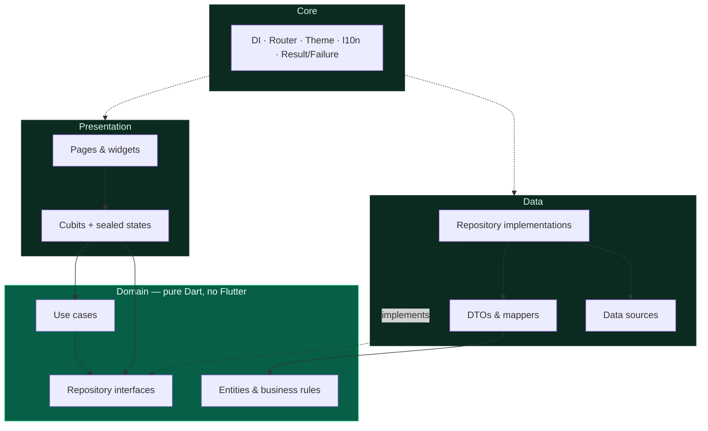
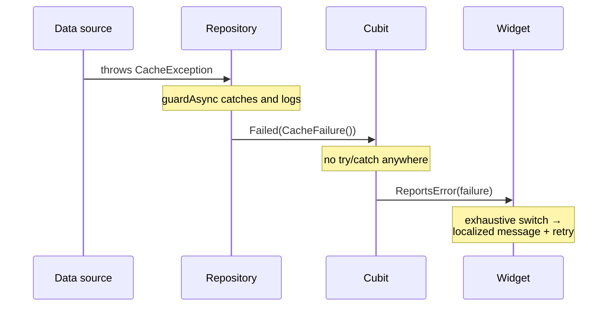

# Damas Dashboard

A bilingual (English / Arabic) business-intelligence dashboard for Flutter, built on Clean Architecture with Bloc, dependency inversion and a token-driven design system.

[](https://flutter.dev)
[](https://dart.dev)
[](#testing)
[](#code-quality)

---

## Overview

Damas Dashboard is an admin console for monitoring commercial performance. It presents key metrics with period-over-period comparison, a revenue time series, a recent-activity feed, a searchable report library, and user preferences that persist across launches.

Its purpose in this repository is to be a **reference implementation**: a small enough product to read end to end, structured the way a codebase that has to survive several years and several engineers is structured.

Every screen works in both English and Arabic, including right-to-left layout, Arabic-Indic numerals, locale-aware date formats, and correct Arabic plural forms.

> **On the data layer.** The app ships with a bundled JSON data source rather than a live backend. This is a deliberate, isolated choice: the JSON is shaped like an API response, parsed through DTOs, and reached only through repository interfaces. Swapping in a REST client means adding one data source and changing one line of dependency registration — no domain or presentation code changes. See [Remaining work](#remaining-work) for what that implies.

---

## Features

**Dashboard & analytics**
- KPI cards with period-over-period deltas that understand direction of *desirability* — falling churn renders as a positive result, not a red one
- Revenue line chart with labelled axes, touch tooltips and a screen-reader description
- Recent-activity feed with relative timestamps

**Reports**
- Search, status filter and four sort orders, all applied outside the widget layer
- Search normalises Arabic orthography, so `احمد` matches `أحمد` and text with diacritics is still findable
- Delete with a confirmation dialog and undoable-by-refresh semantics
- Scheduled-report list with locale-aware weekday and time rendering

**Application**
- Light and dark themes, each designed rather than inverted
- English / Arabic switching at runtime, with full RTL mirroring
- Preferences persisted to disk and applied before the first frame — no theme flash on launch
- Adaptive navigation: drawer on phones, navigation rail from tablet width up
- Distinct loading, empty, "no matches", and error states with retry throughout
- Reduced-motion support on the splash sequence

---

## Architecture

The project uses **Clean Architecture with a feature-first layout**. Dependencies point inward: presentation knows about domain, domain knows about nothing.



The inward arrow that matters is the dashed one: `Repos -.implements.-> Contracts`. The data layer depends on the domain, never the reverse. `lib/features/*/domain/` imports nothing from `package:flutter`, no JSON, and no localization.

That last sentence is not a promise — it is a test. `test/architecture_test.dart` parses every file under `lib/` and fails the build if the domain layer reaches for Flutter, if presentation reaches past the domain into `data/`, if one feature imports another, if `core/` depends on a feature outside the two composition roots, or if a hex color appears outside the palette. It caught a violation in this codebase the first time it ran.

### How a failure travels



Exceptions exist only inside the data layer. Everything above it receives a `Result<T>` — a sealed type whose value is unreachable until the failure branch has been handled.

### Decisions worth explaining

| Decision | Reasoning |
|---|---|
| **Cubit, not Bloc** | These screens react to method calls, not to a stream of domain events. Events would add a class per interaction and buy nothing. |
| **Use cases only where they earn it** | `GetAnalyticsSnapshot` exists because it runs three reads concurrently and collapses them into one result. `FilterReports` exists because search/sort/filter is real, testable logic. A use case that only forwards `repository.getX()` was not written — the cubit calls the repository directly. |
| **Hand-written `Result`/`Failure`** | ~90 lines of sealed classes with exhaustive pattern matching. `dartz` or `fpdart` would add a dependency and a vocabulary (`Either`, `fold`, `bimap`) for no additional safety here. |
| **Failures carry no message** | The domain does not know which language the user reads. `Failure` is a type; `failure_presenter.dart` turns it into text. Adding a variant breaks that exhaustive switch at compile time. |
| **Injected `Clock`** | Nothing calls `DateTime.now()` directly, so relative timestamps and sort order are testable against a frozen clock. |
| **Splash has no domain layer** | It fetches nothing and decides nothing. Giving it a repository for symmetry would be architecture for its own sake. |
| **`labelOf` passed into `FilterReports`** | Search must match what the user sees. Passing a resolver keeps translation out of the domain while letting Arabic search work on Arabic labels. |
| **Semantic colors as a `ThemeExtension`** | "Positive" and "negative" have no home in Material's `ColorScheme`, and hard-coding green/red breaks in dark mode. |

---

## Tech stack

| Concern | Choice |
|---|---|
| Framework | Flutter 3.38 · Dart 3.10 |
| State management | `flutter_bloc` (Cubit) with sealed states |
| Navigation | `go_router` with `StatefulShellRoute` |
| Dependency injection | `get_it`, read only at composition roots |
| Persistence | `shared_preferences` |
| Localization | `flutter_localizations` + ARB (`gen-l10n`), en + ar |
| Formatting | `intl` — numbers, currency, dates, plurals |
| Charts | `fl_chart` |
| Value equality | `equatable` |
| Testing | `flutter_test` with hand-written fakes |

Seven runtime dependencies, each used for something the SDK does not provide. `cupertino_icons` shipped with the Flutter template and was removed — nothing imported it.

---

## Project structure

```
lib/
├── main.dart                      # Single call into bootstrap
├── app/
│   ├── bootstrap.dart             # Composition root: DI, error handlers, first paint
│   ├── app.dart                   # MaterialApp.router, theme + locale resolution
│   └── shell/                     # Persistent frame: one Scaffold, adaptive nav
│
├── core/
│   ├── config/                    # Build constants, dart-define surface
│   ├── data/                      # JSON reading and strict parsing helpers
│   ├── di/injector.dart           # All registrations, grouped per feature
│   ├── error/                     # Exceptions (data), Failures (domain), presenter
│   ├── extensions/                # context.l10n, context.colors, breakpoints
│   ├── l10n/                      # ARB sources + relative-time formatting
│   ├── result/                    # Result<T> and guardAsync
│   ├── router/                    # Routes, router, unknown-route page
│   ├── theme/                     # Palette, tokens, typography, ThemeData
│   ├── utils/                     # Clock, logger, formatters, search normalisation
│   └── widgets/                   # Cross-feature primitives
│
└── features/
    ├── analytics/                 # Metrics, revenue series, activity
    │   ├── data/                  #   datasources · models · repositories
    │   ├── domain/                #   entities · repositories · usecases
    │   └── presentation/          #   cubit · pages · widgets
    ├── reports/                   # Report library, search/filter/sort, delete
    ├── notifications/             # Notification panel and unread badge
    ├── settings/                  # Theme and language preferences
    └── splash/                    # Presentation only — nothing to abstract
```

`assets/data/` holds the seed payloads. Their shape is the contract a real backend would implement.

---

## Screenshots

| Dashboard (light) | Dashboard (dark) |
|---|---|
| _add `docs/screenshots/dashboard-light.png`_ | _add `docs/screenshots/dashboard-dark.png`_ |

| Reports — search & filter | Arabic (RTL) |
|---|---|
| _add `docs/screenshots/reports.png`_ | _add `docs/screenshots/arabic-rtl.png`_ |

| Tablet — navigation rail | Error & empty states |
|---|---|
| _add `docs/screenshots/tablet.png`_ | _add `docs/screenshots/states.png`_ |

---

## Getting started

**Requirements** — Flutter 3.38 or newer (Dart 3.10+). Check with `flutter --version`.

```bash
git clone <repository-url>
cd damas_dashboard

# Installs packages and runs gen-l10n, because pubspec sets `generate: true`.
flutter pub get

flutter run
```

Localizations under `lib/core/l10n/generated/` are generated, not committed. `flutter pub get` produces them; to regenerate by hand, run `flutter gen-l10n`.

### Configuration

There are no secrets in this repository and nothing to configure to run it. Runtime configuration uses compile-time defines:

```bash
flutter run --dart-define=API_BASE_URL=https://api.example.com
```

Read through `lib/core/config/app_config.dart`. Files that would carry credentials (`key.properties`, `google-services.json`, `.env`) are gitignored.

---

## Testing

```bash
flutter test                       # 100 tests
flutter test --coverage
```

| Area | Covered |
|---|---|
| **Architecture rules** | Layer boundaries, feature isolation, no `print`, no stray hex colors |
| `Result` / `Failure` | Branch selection, `map`/`fold`, value equality |
| Arabic search normalisation | Alef/hamza folding, teh marbuta, tashkeel, tatweel |
| `Metric` business rules | Trend, favourability under `lowerIsBetter`, float-noise threshold, null baseline |
| `GetAnalyticsSnapshot` | Concurrency, failure propagation from each branch |
| `AnalyticsRepositoryImpl` | DTO mapping, sorting, windowing, exception → failure |
| `FilterReports` | Filter, search (both languages), four sorts, immutability |
| `ReportsCubit` | State machine, debounce, delete, refresh, emit-after-close |
| `SettingsCubit` | Persistence, no-op writes, failure behaviour |
| `MetricCard` | Formatting, translation, trend tone, semantics, overflow |
| `ReportsPage` | Loading → error → retry → loaded → filter → search → delete, plus RTL |

Fakes are hand-written rather than generated: the contracts are small, and the assertions are about behaviour rather than about which methods were called.

---

## Code quality

```bash
flutter analyze                    # 0 issues
dart format --set-exit-if-changed lib test
```

`analysis_options.yaml` enables strict casts, strict inference and strict raw types, and promotes `use_build_context_synchronously`, `unawaited_futures`, `avoid_print` and dead-code detection from lint to **error**.

Three lints are deliberately off, each with the reason recorded in the file: `always_put_required_named_parameters_first` and `prefer_expression_function_bodies` fight Flutter's own conventions, and `require_trailing_commas` disagrees with `dart format`.

---

## Building

```bash
flutter build apk --debug
flutter build apk --release        # R8 enabled; signs with the debug key
flutter build web --release
```

Release signing uses the debug key so the project builds from a fresh clone. Shipping requires a real upload key in `android/key.properties`.

**Android toolchain.** The Android build did not work at all before this pass: the project pinned Android Gradle Plugin 8.1.0, below Flutter's supported minimum of 8.1.1, so Gradle failed while applying the Flutter plugin — `flutter build apk` could not produce an artifact at any point. AGP is now 8.7.3 with Gradle 8.9, Kotlin 2.1.0 and Java 11. `android.enableJetifier` was switched off (no dependency ships support-library code, and AGP 9 removes the flag), `applicationId` moved off the `com.example.*` placeholder, and the app label reads "Damas Dashboard" rather than the raw package name.

---

## Remaining work

Honest list of what this repository does not do.

- **No backend.** Data comes from bundled JSON. Report deletion mutates an in-memory copy and does not survive a restart. Pagination, caching, retry/backoff and token refresh are unimplemented because there is nothing to page, cache or authenticate against.
- **No authentication.** There are no roles, guards or sessions. `go_router`'s `redirect` is where a guard would attach.
- **"Generate report", "Export CSV", "Profile", "Security", "Help"** show an explicit "not available in this build" message rather than pretending to work.
- **No integration tests.** The `ReportsPage` widget test covers the fullest user journey (load → filter → search → delete → confirm). A true `integration_test/` suite needs a driver target and a device.
- **The Android *release* build has not completed locally.** `flutter build apk --debug` succeeds on the current toolchain. The release variant reaches `:app:compileReleaseKotlin` and then fails downloading Flutter's per-ABI release engine JARs from `storage.googleapis.com` — a flaky-network symptom on the development machine rather than a project defect (the debug build hit the same error and succeeded on Flutter's automatic retry). R8 and resource shrinking are therefore configured but not yet exercised; the CI workflow builds the release APK on push, which is where that gets covered.
- **iOS, macOS, Linux and Windows are unverified.** Only Android and web builds were run. No platform-specific code is used, so they are expected to work.
- **Arabic translations are unreviewed.** They are the author's own and have not been checked by a native-speaking reviewer.
- **`fl_chart` is pinned to 0.66.** 1.x is available; the upgrade is a small API migration that was left out of this pass to keep the diff reviewable.
- **App version is a constant** in `app_config.dart` that must be kept in step with `pubspec.yaml`. Reading it at runtime would mean adding `package_info_plus` for one string.
